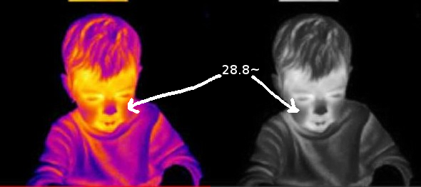

# ThermoGray

<p align="center"></p>

ThermoGray it's a solution for detecting if a child with cancer have a fever or not if so the solution notify the nurse to comes give the child the medicine.


## Dataset's
Link to the dataset: https://drive.google.com/open?id=1wPjucswpLydSHf8ltSjZdOSDogjDD8D3

# Deep-Learning

- [x] Training data (programmatically).
- [x] Data augmentation (programmatically).
- [x] Batch to make a `CSV` dataset table.
- [x] Datasets classification.
- [x] Datasets regression.
- [x] CoLab training our dataset (a free GPU, google solution.).
- [ ] Working on the application...

## colab simple code
```
from google.colab import drive
drive.mount('/content/gdrive', force_remount=True)
!echo "[ ! ] Starting..."
!cd "/content/gdrive/My Drive/Colab Notebooks" && python run.py
```
# CSV template
path | temperature
--- | ---
~/my/path/ | 39.9
~/my/path/ | 37.9
~/my/path/ | 36.4
